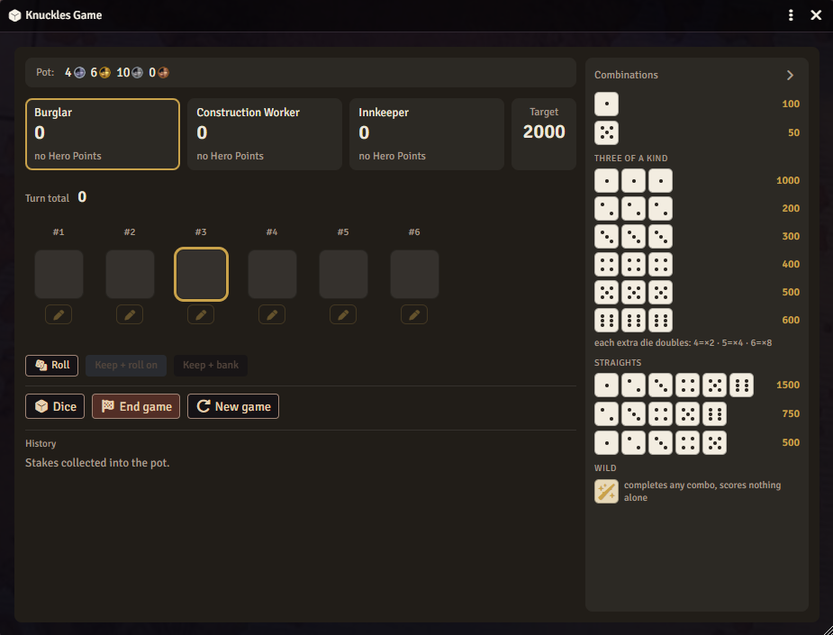
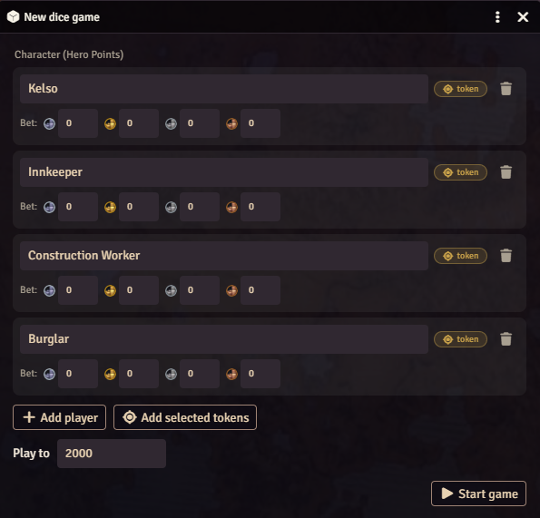
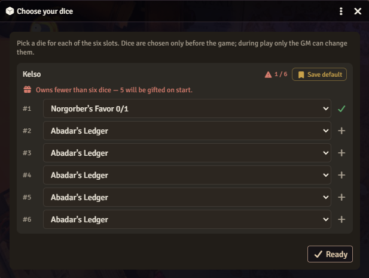
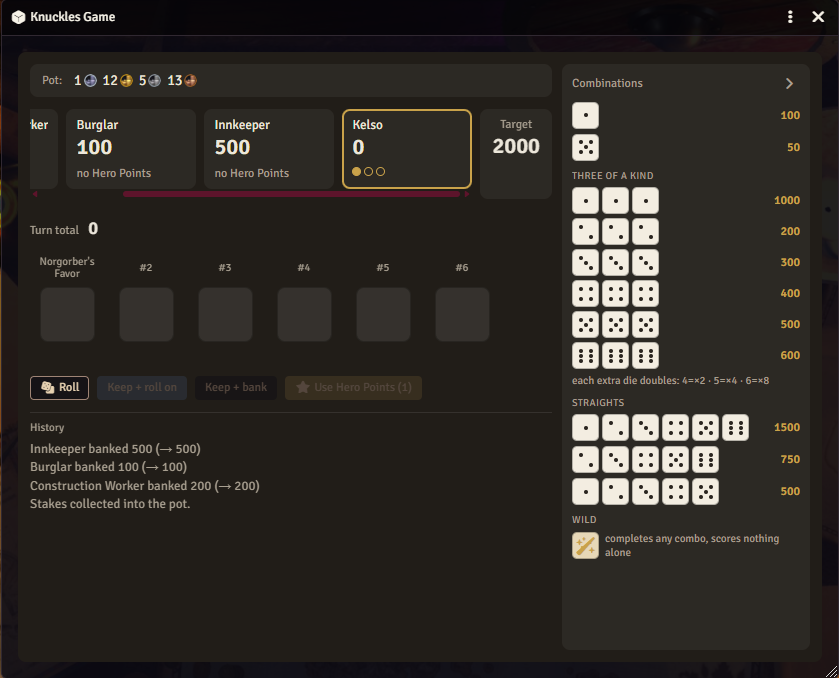
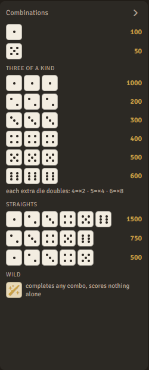
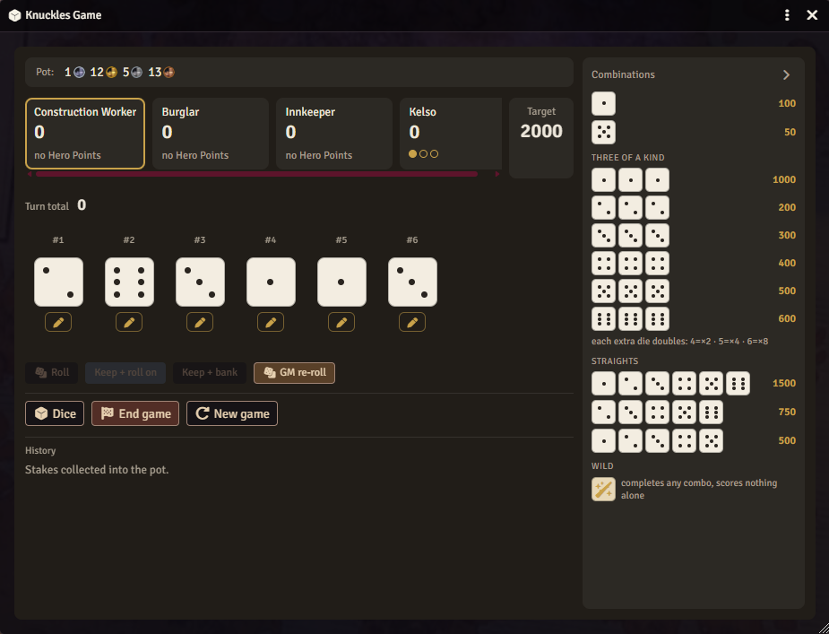
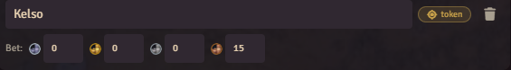
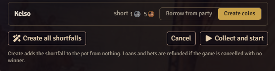
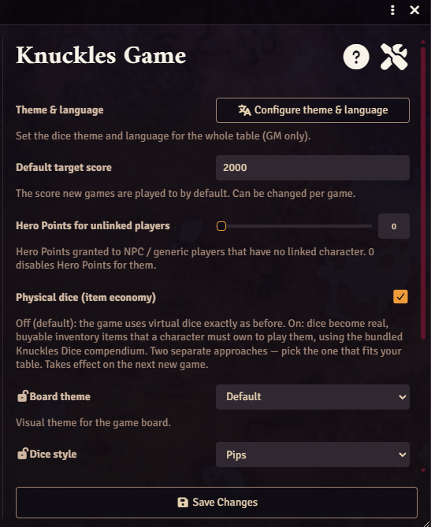

# Knuckles Game

[](https://github.com/Zeitcatcher/knuckles-game/releases/latest)
[](https://github.com/Zeitcatcher/knuckles-game/releases)

A Farkle-style tavern dice game for Foundry VTT: live multiplayer, a catalog of loaded dice, per-table themes and languages, and optional coin wagers.

> Roll six dice, set aside the scoring ones, and push your luck. Bank your points, or roll on and risk a bust.



## What it is

Knuckles is the game the tavern regulars play in the back room. On your turn you roll six dice, keep the ones that score, then choose: bank what you have, or roll the rest again and risk rolling nothing (a bust), which wipes the turn. The first player to the target score triggers one last round; when it ends, the highest total wins.

The dice are the twist. Past the honest set there's a catalog of loaded dice with hidden face weights, from one that almost always lands on 1 to a sharper's die that only nudges the odds. There's a wild joker too. Some tables treat all this as a bit of fun; others treat it as grounds for a bar fight.

Play is networked and live. Everyone sees the same board update in real time, acts on their own turn from their own screen, and spectators can watch.

## System support

The core game runs on any Foundry system. It carries its own dice logic and reads nothing from the game system. A few extras use Pathfinder 2e when it's installed: Hero Point re-rolls, the coin wagers and pot payout, and the physical-dice economy. Without pf2e those extras stay off and the virtual game plays normally.

Version 1.0.0 is verified on Pathfinder 2e (Foundry v13 and up, tested on v14). Other systems should work but aren't tested yet.

## Features

- Live per-player multiplayer over socketlib. The GM is authoritative; each player rolls on their own turn, and spectators see the board too.
- 37 loaded dice with hidden face weights, including a wild joker. Fair dice by default.
- Optional 3D throws via Dice So Nice.
- Per-table dice themes and languages, set by the GM. Ships with two themes; the interface is English and Russian.
- A collapsible panel that lists every scoring combination as dice.
- Per-character default loadouts that survive between sessions.
- Full mouse or keyboard play.

### Pathfinder 2e extras

Used when pf2e is installed:

- Hero Points: spend one to re-roll dice from your last throw.
- Coin wagers and a shared pot. Bets are collected when the game starts and refunded if it ends with no winner. If a player is short, the GM creates the missing coins or borrows them from party members.
- A physical-dice economy where the dice are real pf2e items you buy and carry, priced from 5 cp to 850 gp.

## Requirements

- Foundry VTT v13 or newer (tested on v14).
- socketlib, required, for the multiplayer sync.
- Dice So Nice, recommended, for the 3D dice.
- Pathfinder 2e, optional, for the extras above.

## Installation

In Foundry, open Add-on Modules, choose Install Module, and paste this manifest URL:

```
https://github.com/Zeitcatcher/knuckles-game/releases/latest/download/module.json
```

Enable Knuckles Game in your world.

## How to play

1. The GM opens the game from the token toolbar or the Knuckles Game macro, then builds the table: add players by name or from selected tokens, set optional wagers and the target score, and start.



2. Each player picks six dice. Owned dice sort to the top, and a loadout can be saved as the default for next time.



3. On your turn, roll, click the scoring dice to set them aside, then bank the points or roll again. Roll nothing and you bust, losing the turn's points.



4. The combinations panel on the right lists every scoring combination.



### Scoring

| Combination | Points |
|---|---|
| Single 1 | 100 |
| Single 5 | 50 |
| Three of a kind (1 / 2 / 3 / 4 / 5 / 6) | 1000 / 200 / 300 / 400 / 500 / 600 |
| Each die past the third | doubles the triple |
| Straight 1-2-3-4-5 | 500 |
| Straight 2-3-4-5-6 | 750 |
| Full straight 1-2-3-4-5-6 | 1500 |

The wild joker completes any combination but never scores by itself.

## GM tools

The GM sees controls players don't: a free re-roll that costs no Hero Point, a die-value override, and gifting dice to a player. If the game is reloaded mid-session, the GM is asked whether to resume it or discard it.



### Quick hands for opponents

Building six dice by hand for every tavern regular gets old. Each row of the dice picker carries a GM-only strip: choose how many loaded dice to deal, how much the hand may spend, random picks or a matched set, then press Deal. Every participant keeps its own settings, so the drunk at the bar can hold two cheap tricks while the sharper at the next table runs a purse worth thousands.

The class is a budget for the whole hand, not a limit per die, and the generator shops with it. A rich hand that opens with the 1500 gp die has spent most of its money, so the slots after it fill with whatever is still affordable, down to pocket-change junk. That descending tail is deliberate: a cheat's hand should look like a real purchase. It also means a commoner can never be dealt a monster by accident, because the money simply isn't there.

The toolbar at the top deals to every NPC and generic row at once, and leaves player characters alone.

### Making your own dice

A player carves their own knucklebone, and you can put it in the game. Custom dice opens a builder that takes a name, a description and a price, plus the chance of each face. Only the name is required. Give the die an image of its own if you have one; left alone it wears the same art as the shipped dice.

The six chances share one pool of 100%. Type a value and that face is locked; leave a face blank and it splits whatever is left, showing the share it would take. Nothing you type can push the total past 100, and the die can't be created until it adds up. The price decides which hands can afford to be dealt it.

A finished die joins the catalog for everyone. It appears in every slot dropdown right under the honest die, marked with a star, and rolls with the odds you set. On Pathfinder 2e it also becomes an Item in the world directory, so you can drag it onto a sheet and the physical-dice economy counts it like any shipped die. Editing a die updates the copies already in inventories; deleting one takes those copies with it, and is refused while someone is holding it in a running game.

The builder opens from the Custom dice button in the setup and dice-picker footers.

## Wagers (Pathfinder 2e)

Bets are set per player at setup and taken when the game starts, so the pot holds real coin. If someone can't cover their bet, the GM gets a stakes window.



Two choices per short player: create the missing coins (useful for NPC tokens with no money) or borrow from party members. The GM picks who lends, and the shortfall splits evenly among them. End a game with no winner and every collected stake is refunded.



## Themes and languages

The GM sets one theme and language for the whole table, and every die name and description follows it. Other modules can register their own theme.



## Development

```
npm install
npm test      # unit tests (Vitest)
npm run build # regenerate and compile the compendium packs
```

Game rules live in src/core as framework-free, tested modules. Foundry glue is in src/foundry, networking in src/net, and the UI in src/apps and src/presentation.

## Credits

Built for Foundry Virtual Tabletop by Zeitcatcher. Requires socketlib; the 3D dice use Dice So Nice.

The Pathfinder dice theme uses deity names and flavor that are Product Identity of Paizo Inc., under the Paizo Community Use Policy. This product is not published, endorsed, or approved by Paizo. For more about Paizo and Pathfinder, see paizo.com.

## License

[](LICENSE)

Knuckles Game is under the PolyForm Noncommercial License 1.0.0: free to use and modify for any noncommercial purpose, with a separate license required to sell it. The Pathfinder theme's flavor stays under the Paizo Community Use Policy and must remain free. See LICENSE.
